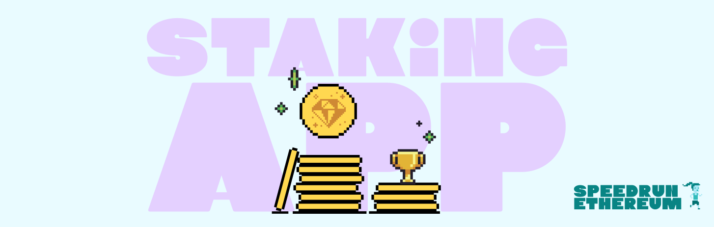
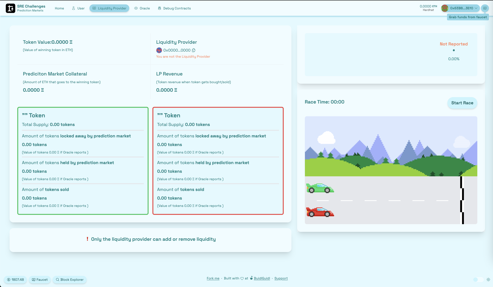
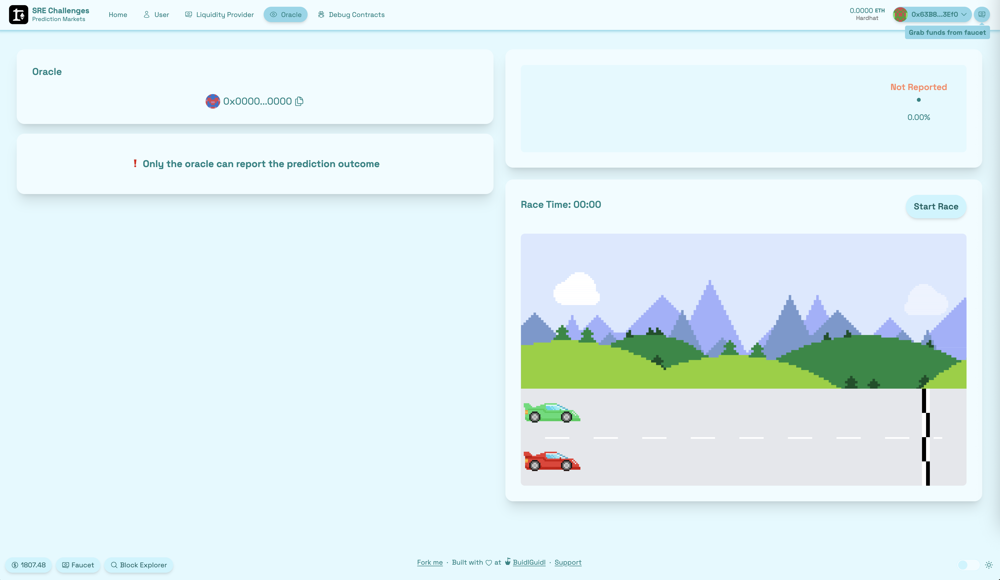
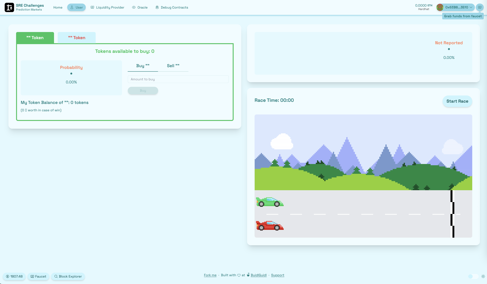
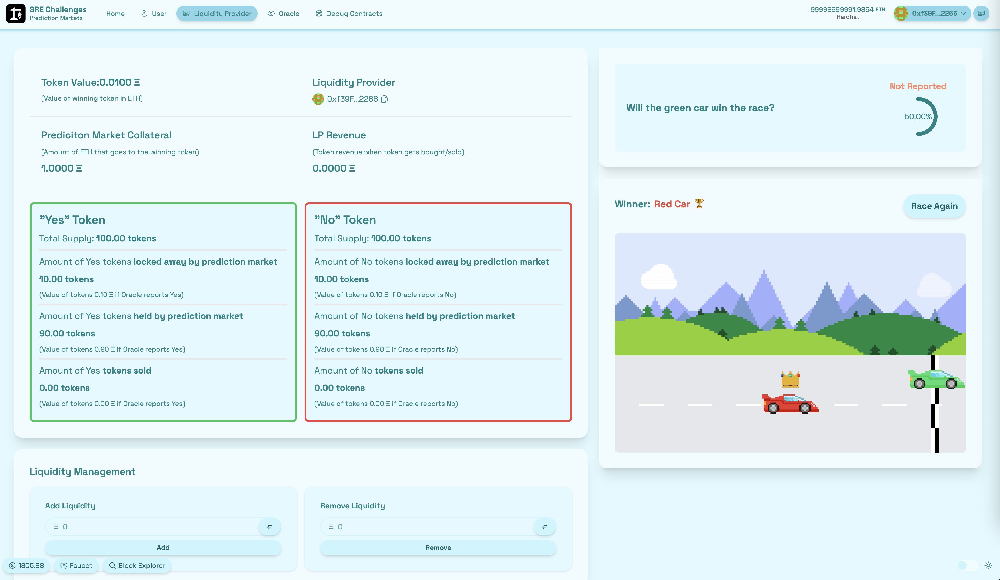
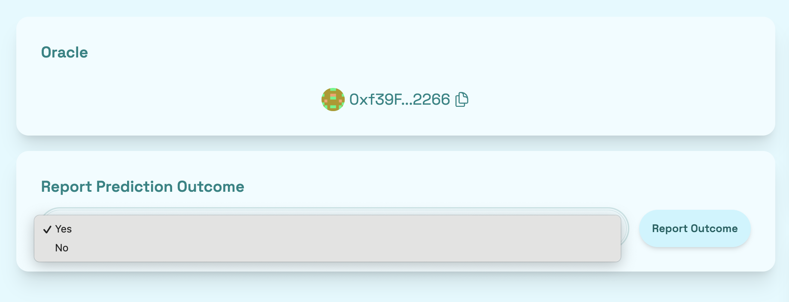
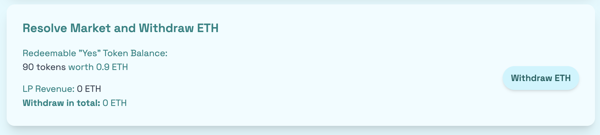
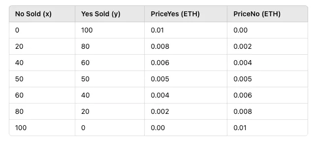
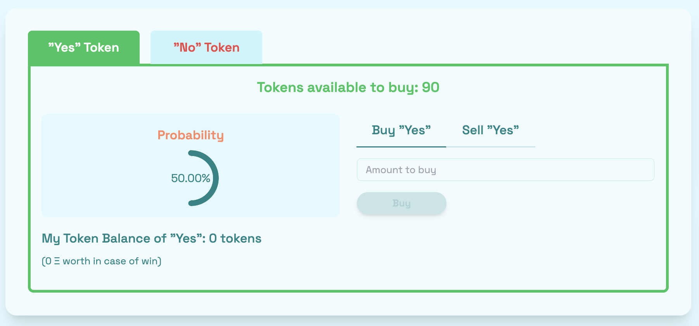
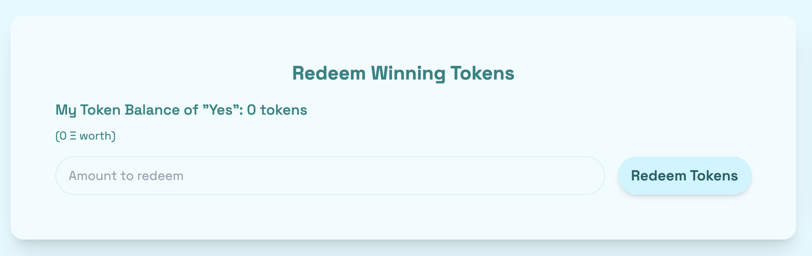

# 📈📉🏎️ Prediction Markets Challenge



# Introduction

🔮 This challenge will guide you through building and understanding a simple prediction market, where users can buy and sell ERC20 outcome shares based on the result of an event. You'll step into three roles: liquidity provider, oracle, and user. The event? A car race between a green and a red car! 🏎️🏁

<details markdown='1'><summary>Why Prediction Markets Matter (click to expand)</summary>
Prediction markets have been around for a long time, with records of **election betting on Wall Street dating back to 1884** (see [this Wikipedia page](https://en.wikipedia.org/wiki/Prediction_market)). On **Ethereum**, they've been a topic of interest for quite some time, but they never really took off, until now.

Polymarket, a prediction market, is one of the most widely used blockchain applications today by both crypto natives and everyday users. It gained especially significant traction around the **U.S. elections.**

For example, during the **2024 U.S. Presidential Election**, Polymarket saw over **$3.3 billion** wagered on the race between **Donald Trump and Kamala Harris** (as of November 5, 2024). [[Source](https://en.wikipedia.org/wiki/Polymarket)]

At its core, a prediction market is a **betting market** where users can wager on the outcome of a future event with a **fixed end date**. The key difference from traditional betting platforms is that, in most cases, **once you place a bet, you're locked in**. But in a **prediction market**, you can **sell your position** before the event concludes.

The more people bet on a particular outcome, the **more expensive** that side becomes, while the opposite side gets **cheaper**. This **dynamic pricing mechanism** determines an implied **probability**, which can sometimes be more accurate than expert opinions, polls, or pundits.

In this tutorial, we'll guide you through the fundamental Solidity functions and explore how a fully on-chain prediction market could be structured. Our focus will be on trading and liquidity provision. This decentralized prediction market enables anyone to place bets on a predefined question for a future event with the two outcomes "Yes" or "No".

</details>

### 🧠 How Our Prediction Market Works

We build a binary prediction market, meaning users bet on a yes-or-no question, like in this case:

> ❓ Will the green car win the race?

When you buy a share, you’re choosing between two outcome tokens: "Yes" and "No". Each share can be traded any time before the market closes.

- ✅ If you hold the winning token, it pays out 0.01 ETH

- ❌ If you hold the losing token, it’s worth 0 ETH

- 🧮 Before the result is known, token prices fluctuate between 0 and 0.01 ETH, reflecting the probability of each outcome

- 🔄 The sum of both token prices always equals 0.01 ETH, just like on Polymarket where one share pays out 1 USDC

### 🔄 Why Ours Is Different

Unlike traditional betting markets, we don’t lock you in after buying. You can buy or sell outcome shares anytime, as long as the market hasn’t been resolved.

Instead of an order book like Polymarket, we use an Automated Market Maker (AMM). That means:

- 🧪 You can trade instantly — no need to find someone on the other side

- 💸 It’s easier to implement and more gas-efficient on-chain

### 💧 Where Liquidity Comes From

To launch a market, someone must provide initial liquidity — locking in collateral to back the outcome tokens.

- Liquidity providers (LPs) earn fees from trading activity

- But they also take on risk, since losing tokens become worthless

That’s why popular platforms curate markets to ensure there’s enough interest and volume (see Polymarket docs).

### 🌐 But Who Decides the Outcome?

Blockchains can’t know if a race was won or lost — so we use oracles.

An oracle is a decentralized way to fetch real-world data (like “Which car won?”) and report it on-chain in a way that everyone can trust. Without oracles, there’s no way to settle prediction markets securely.

Let's jump into the challenge.

> 💬 Meet other builders working on this challenge and get help in the [Prediction Markets Challenge Telegram Group](https://t.me/+NY00cDZ7PdBmNWEy)

## **Checkpoint 0: 📦 Environment 📚**

Before you begin, you need to install the following tools:

- [Node (v18 LTS)](https://nodejs.org/en/download/)
- Yarn ([v1](https://classic.yarnpkg.com/en/docs/install/) or [v2+](https://yarnpkg.com/getting-started/install))
- [Git](https://git-scm.com/downloads)

Then download the challenge to your computer and install dependencies by running:

```sh
npx create-eth@0.1.8 -e prediction-markets prediction-markets
cd prediction-markets
```

in the same terminal, start your local network (a blockchain emulator in your computer):

```sh
yarn chain
```

in a second terminal window, 🛰 deploy your contract (locally):

```sh
cd prediction-markets
yarn deploy
```

in a third terminal window, start your 📱 frontend:

```sh
cd prediction-markets
yarn start
```

📱 Open [http://localhost:3000](http://localhost:3000/) to see the app.

> 👩‍💻 Rerun yarn deploy whenever you want to deploy new contracts to the frontend. If you haven't made any contract changes, you can run yarn deploy --reset for a completely fresh deploy.

Head to the **`Debug Contracts`** tab and you should find a smart contract named **`PredictionMarket`**. This is our main contract and the one we'll be working on throughout the challenge. Since we haven't implemented any functions yet, they all shouldn't work neither do you see all necessary state variables.

> 🏎️ 🏁 Since we want to build a prediction market around our car race head to the `User` tab and check it out! (The race is entirely separate and has no impact on the smart contract.)

## **Checkpoint 1: 🔭 Understanding the protocol 📺**

At its core, our prediction market has three essential parts:

- 🪙 Tokens (like ERC20s) to represent outcomes

- 💧 Trading mechanism (AMM or order book) to let users buy/sell shares

- 🔮 An oracle to settle the final outcome

In our version, when you deploy the market, it spins up two ERC20 tokens — one for "Yes", one for "No".

🧱 You’ll find the token logic in `packages/hardhat/contracts/PredictionMarketToken.sol`

This contract extends the standard ERC20 spec with custom minting and burning logic. There’s also a transfer restriction in place to prevent the market owner from moving tokens — more on why later 👀

### 🛠️ The Main Contract: PredictionMarket.sol

You’ll be working directly in `packages/hardhat/contracts/PredictionMarket.sol`.

Our protocol revolves around three roles:

1. **👷‍♂️ Market Owner & Liquidity Provider** – sets up the market and seeds it with ETH

2. **🧙 Oracle** – reports the final outcome (yes or no)

3. **🙋‍♂️ User** – trades shares and tries to win ETH

And guess what? You’ll take on all three roles during this challenge.

But we’ll start with the most important one: **👉 Market Owner & Liquidity Provider**

### 💦 Why Liquidity Comes First

In an AMM-based system like ours, markets can’t function without initial liquidity. That means someone must deposit ETH up front.

Here’s what happens when a new market is deployed:

- ETH is deposited as collateral

- The contract creates the "Yes" and "No" ERC20 tokens

- It mints tokens and adds them to the liquidity pool

- Later on, more liquidity can be added or removed

You’ll implement this logic in Checkpoints 2, 3, 4, and 6, under the Liquidity Provider tab.

<details markdown='1'><summary>Have a look at the Liquidity Provider tab (click to expand)</summary>
    
</details>

> ❗️In the current state your front-end is already implemented but the buttons of the different function will likely break since there is no implementation code within your smart contracts yet. But soon there will! 🙂

### 🔮 Be the Oracle

Once the market is set up, someone needs to decide how it ends.

In Checkpoint 5, you’ll become the Oracle — the one who reports the final outcome of the event on-chain (Oracle tab).

> 🧙‍♂️ Oracles are how off-chain facts (like “Did the green car win?”) make their way into the blockchain world.

<details markdown='1'><summary>Have a look at the Oracle tab (click to expand)</summary>
    
</details>

### 👥 Then It's Time to Trade!

After the market is created and the oracle is ready, it’s the users’ turn to jump in (User tab).

In Checkpoints 7 to 9, you’ll build out the core user actions:

- 🛒 Buy outcome tokens

- 💸 Sell them to exit positions

- 🎉 Redeem them once the result is in

You’ll have full trading functionality from end to end — all powered by your smart contracts.

<details markdown='1'><summary>Have a look at the User tab (click to expand)</summary>
    
</details>

> 🎉 You've made it this far in Scaffold-Eth Challenges 👏🏼 . As things get more complex, it might be good to review the design requirements of the challenge first! Check out the empty PredictionMarket.sol file to see aspects of each function. If you can explain how each function will work with one another, that's great! 😎

> 🚨 🚨 🦈 The Guiding Questions will lead you in the right direction, but try thinking about how you would structure each function before looking at these!

> 🚨 🚨 🦖 The code blobs within the toggles in the Guiding Questions are some examples of what you can use, but try writing the implementation code for the functions first!

## **Checkpoint 2: 🔭 The Prediction Market Setup 🏠**

Before we can deploy your prediction market smart contract, we need to set up the constructor and declare some critical variables — this is the foundation the whole market will run on.

Think of this step as bootstrapping your protocol’s brain 🧠

### 🧱 Constructor Parameters

When you deploy the market, you’ll provide:

- **🧙 `_oracle`** – the address that will later report the outcome

- **❓ `_question`** – the actual prediction being asked (e.g., "Will the green car win?")

- **💰 `_initialTokenValue`** – the ETH value a winning token pays out (e.g., 0.01 ETH)

- **📈 `_initialYesProbability`** – how likely “Yes” is at the start (e.g., 50 for 50%)

- **🔒 `_percentageToLock`** – used in probability + pricing logic (you’ll dive deeper into this in Checkpoint 3)

### 🧮 Futher State Variables

Your contract will also need to track the following data throughout the life of the market:

- **🏆 `s_ethCollateral`**: the total ETH backing the tokens — think of this as your prize pool
- **💸 `s_lpTradingRevenue`** - tracks the fees earned from users buying/selling tokens — the LP’s reward

> ❗️For easier testing, we set the oracle address to be the same as the liquidity provider during deployment (see `00_deploy_your_contract.ts`). Also, **double-check the parameter values** we're passing into the constructor, like `_question`, etc. (Hint: Add the first Anvil account to your wallet to interact as the oracle or contract owner.)

> ⏰ 🚨 In a prediction market in production, you would typically include a time-based restriction, a **fixed end date** to ensure that outcomes can only be reported after the predicted event occurs. For simplicity and ease of testing, we omit this time component in this implementation.

> 💡 `i_<variableName>` indicates an immutable variable, whereas `s_<variableName>` is a normal state variable that can be modified.

Alright, let’s jump into the contract and start laying the foundation of your prediction market!

<details markdown='1'><summary>🦉 Guiding Questions</summary>

<details markdown='1'><summary>Question 1</summary>

> What are the most important state variables, we need to track (Hint: look into the constructor)? How can we initialize them with the right value in the constructor? Which variables can be set to `immutable`?

</details>

<details markdown='1'><summary>Question 2</summary>

> What important checks should we include in the constructor before deploying the contract? (Hint: refer to the questions below for additional guidance, and make sure to use the appropriate custom errors from the `errors` section where applicable)

</details>

<details markdown='1'><summary>Question 3</summary>

> How can we ensure that a prediction market cannot be created without any initial liquidity?

</details>

<details markdown='1'><summary>Question 4</summary>

> How do we validate that `_initialYesProbability` is within the valid range of 0% to 100%?

</details>

<details markdown='1'><summary>Question 5</summary>

> How do we prevent `_percentageToLock` from exceeding 100%?

</details>

After thinking through the guiding questions, have a look at the solution code!

<details markdown='1'><summary>👩🏽‍🏫 Solution Code</summary>

```javascript
//////////////////////////
/// State Variables //////
//////////////////////////

address public immutable i_oracle;
uint256 public immutable i_initialTokenValue;
uint256 public immutable i_percentageLocked;
uint256 public immutable i_initialYesProbability;

string public s_question;
uint256 public s_ethCollateral;
uint256 public s_lpTradingRevenue;

//////////////////
////Constructor///
//////////////////

constructor(
    address _liquidityProvider,
    address _oracle,
    string memory _question,
    uint256 _initialTokenValue,
    uint8 _initialYesProbability,
    uint8 _percentageToLock
) payable Ownable(_liquidityProvider) {
    /// Checkpoint 2 ////
    if (msg.value == 0) {
        revert PredictionMarket__MustProvideETHForInitialLiquidity();
    }
    if (_initialYesProbability >= 100 || _initialYesProbability == 0) {
        revert PredictionMarket__InvalidProbability();
    }

    if (_percentageToLock >= 100 || _percentageToLock == 0) {
        revert PredictionMarket__InvalidPercentageToLock();
    }

    i_oracle = _oracle;
    s_question = _question;
    i_initialTokenValue = _initialTokenValue;
    i_initialYesProbability = _initialYesProbability;
    i_percentageLocked = _percentageToLock;

    s_ethCollateral = msg.value;

    /// Checkpoint 3 ////

}
```

</details>

</details>

Run the following command to check if you implement all variable and checks correctly.

```sh
yarn test --grep "Checkpoint2"
```

> 🚨 Before we deploy the contract we need to finish implementing the constructor in the next checkpoint 3.

## **Checkpoint 3: 🔨🪙 Mint the tokens**

Time to give your prediction market its trading power — by minting the "Yes" and "No" tokens!

When you deploy your PredictionMarket contract, you’ll also spin up two ERC20 token contracts, one for each outcome. This all happens right inside the constructor.

### 🚀 Deploying the Tokens

When deploying the prediction market contract, we also need to deploy the associated **"Yes"** and **"No"** token contracts. To ensure this happens, we instantiate both token contracts inside the constructor.

Your job is to deploy both outcome tokens by passing the right parameters into the PredictionMarketToken constructor.

You’ll need to provide:

- 🏷️ The token **name** ("Yes" or "No")

- 🔤 The token **symbol** ("Y" or "N")

- 👤 The market owner’s **address**

- 🔢 The **initial token supply** (calculated below)

To calculate how many tokens to mint, you take the ETH sent into the contract and divide it by `_initialTokenValue`. This gives you the number of outcome tokens the market will be able to support:

$$initialTokenAmount = \frac{msg.value}{initialTokenValue}$$

You’ll store your deployed token contracts in the state variables:

- `i_yesToken`
- `i_noToken`

### 🎯 Setting the Initial Probability

As the market creator, you get to define the starting odds — the initial probability of the "Yes" outcome.

For example, if you think the green car has a good shot at winning, you might set:

$$initialYesProbability = 60$$

But here’s the twist: there haven't been any trades yet. So how can the protocol incoproate he initial probability?

### 🔒 Locking Tokens to Simulate Probability

We use a token lock mechanism. By locking tokens as if they’ve already been bought, we give the market a stable starting point.

> 🧠 That’s why token transfers are disabled for the market creator in PredictionMarketToken.sol — to keep these locked tokens from circulating.

### 🧮 Let’s See It in Action

Say we mint 100 "Yes" and 100 "No" tokens.

You want to simulate a 60% "Yes" probability and lock 10% of total tokens.

We calculate the locked amount like this:

$$lockedYes = 100 * 60\% * 10\% * 2 = 12$$

$$lockedNo = 100 * 40\% * 10\% * 2 = 8$$

That gives us:

- 12 locked "Yes" tokens

- 8 locked "No" tokens

- 88 "Yes" + 92 "No" tokens available for trading

So our starting probability looks like:

$$\frac{12}{12 + 8} = 60\%$$

### 🗝️ Why Locking Matters

1. 🧘‍♂️ Smoother starts – Prevents wild swings from a single trade
   Without locking, a single "Yes" purchase pushes the probability to 100%:
   $$\frac{1}{1 + 0} = 100\%$$
2. ⚖️ Price stability – Token price depends on the current market probability:
   $$
   tokenPrice = initialTokenValue * marketProbability
   $$

This gives your market a balanced and fair launch, with built-in stability right from the start.

You’re not just minting tokens — you’re shaping the early behavior of your market.

Ready to code?

> 💡 The percentage can be chosen arbitrarily, it depends on how you want to set up the prediction market. The more you lock from the beginning the lesser are the price swings but also there is less liquidity to trade.

<details markdown='1'><summary>🦉 Guiding Questions</summary>

<details markdown='1'><summary>Question 1</summary>

> How do we calculate the correct initialTokenAmount for each token? (Hint: Don't forget to use the PRECISION constant to handle decimal values properly, as Solidity does not support floating-point arithmetic)

</details>

<details markdown='1'><summary>Question 2</summary>

> How can we create the two token contracts for "Yes" and "No" outcomes and mint the correct amount of tokens for each? (Hint: Take a look at the PredictionMarketToken.sol contract for guidance.)

</details>

<details markdown='1'><summary>Question 3</summary>

> After minting the correct amount of tokens, how do we ensure that the appropriate portion is locked away to reflect the initial probability set by the prediction market? How can we correctly transfer these locked tokens to the contract owner's address?

</details>

After thinking through the guiding questions, have a look at the solution code!

<details markdown='1'><summary>👩🏽‍🏫 Solution Code</summary>

```javascript
//////////////////////////
/// State Variables //////
//////////////////////////

PredictionMarketToken public immutable i_yesToken;
PredictionMarketToken public immutable i_noToken;

//////////////////
////Constructor///
//////////////////

constructor(
    address _liquidityProvider,
    address _oracle,
    string memory _question,
    uint256 _initialTokenValue,
    uint8 _initialYesProbability,
    uint8 _percentageToLock
) payable Ownable(_liquidityProvider) {
    /// Checkpoint 2 ////
    if (msg.value == 0) {
        revert PredictionMarket__MustProvideETHForInitialLiquidity();
    }
    if (_initialYesProbability >= 100 || _initialYesProbability == 0) {
        revert PredictionMarket__InvalidProbability();
    }

    if (_percentageToLock >= 100 || _percentageToLock == 0) {
        revert PredictionMarket__InvalidPercentageToLock();
    }

    i_oracle = _oracle;
    s_question = _question;
    i_initialTokenValue = _initialTokenValue;
    i_initialYesProbability = _initialYesProbability;
    i_percentageLocked = _percentageToLock;

    s_ethCollateral = msg.value;

    /// Checkpoint 3 ////
    uint256 initialTokenAmount = (msg.value * PRECISION) / _initialTokenValue;
    i_yesToken = new PredictionMarketToken("Yes", "Y", msg.sender, initialTokenAmount);
    i_noToken = new PredictionMarketToken("No", "N", msg.sender, initialTokenAmount);

    uint256 initialYesAmountLocked = (initialTokenAmount * _initialYesProbability * _percentageToLock * 2) / 10000;
    uint256 initialNoAmountLocked =
        (initialTokenAmount * (100 - _initialYesProbability) * _percentageToLock * 2) / 10000;

    bool success1 = i_yesToken.transfer(msg.sender, initialYesAmountLocked);
    bool success2 = i_noToken.transfer(msg.sender, initialNoAmountLocked);
    if (!success1 || !success2) {
        revert PredictionMarket__TokenTransferFailed();
    }
}
```

</details>

</details>

Run the following command to check if you implement all variable and checks correctly.

```sh
yarn test --grep "Checkpoint3"
```

### ✅ Tests Passed? You're So Close!

Nice work — if your tests are green, you're just one step away from deployment! 🚀

Before you hit deploy, do this quick but important fix:

👇 Scroll down to the `getPrediction()` function in your contract and…

🧩 Uncomment everything below: `/// Checkpoint 3 ///`

This function brings our values to the front end.

> 💡 You might see warnings like "Unused function parameter: isReported" or winningToken — no worries, you can safely ignore those for now.

Once that's done, you're ready to deploy! 🔗

> Run `yarn deploy` and check out the front-end

Once deployed, head over to the **Debug** page to inspect the initialized values.

The tab **Liquidity Provider** in the front-end should now also display the initial question, initial liquidity/probability and further relevant variables (see screenshot below how it should look like).



## **Checkpoint 4: 💦 More Liquidity**

Now that your market is live, it’s time to give the liquidity provider more control 💪

In this checkpoint, you'll implement the addLiquidity and removeLiquidity functions — allowing the market owner to inject more ETH or pull it out, while automatically minting or burning outcome tokens to keep the balance.

To keep things simple, we’re only allowing the original market creator to call these functions. That’s already enforced with the onlyOwner modifier 🔒

Let’s build it! 🧱

> 💡 The events are already defined in the **events** section.

<details markdown='1'><summary>🦉 Guiding Questions</summary>

<details markdown='1'><summary>Question 1</summary>

> How do we track newly added liquidity, and how do we mint the corresponding amount of "YES" and "NO" tokens for the prediction market?

</details>

<details markdown='1'><summary>Question 2</summary>

> What validations or checks should we implement in the removeLiquidity function?

</details>

<details markdown='1'><summary>Question 3</summary>

> How do we determine the correct amount of tokens to remove, and what is the process for removing them? (Hint: Refer to PredictionMarketToken.sol)

</details>

<details markdown='1'><summary>Question 4</summary>

> Which state variable needs to be updated during this process?

</details>

<details markdown='1'><summary>Question 5</summary>

> Which events do we want to emit? (Hint: have a look into the predefined events)

</details>

After thinking through the guiding questions, have a look at the solution code!

<details markdown='1'><summary>👩🏽‍🏫 Solution Code</summary>

```javascript
/////////////////
/// Functions ///
/////////////////

function addLiquidity() external payable onlyOwner {
    //// Checkpoint 4 ////
    s_ethCollateral += msg.value;

    uint256 tokensAmount = (msg.value * PRECISION) / i_initialTokenValue;

    i_yesToken.mint(address(this), tokensAmount);
    i_noToken.mint(address(this), tokensAmount);

    emit LiquidityAdded(msg.sender, msg.value, tokensAmount);
}

function removeLiquidity(uint256 _ethToWithdraw) external onlyOwner {
    //// Checkpoint 4 ////
    uint256 amountTokenToBurn = (_ethToWithdraw / i_initialTokenValue) * PRECISION;

    if (amountTokenToBurn > (i_yesToken.balanceOf(address(this)))) {
        revert PredictionMarket__InsufficientTokenReserve(Outcome.YES, amountTokenToBurn);
    }

    if (amountTokenToBurn > (i_noToken.balanceOf(address(this)))) {
        revert PredictionMarket__InsufficientTokenReserve(Outcome.NO, amountTokenToBurn);
    }

    s_ethCollateral -= _ethToWithdraw;

    i_yesToken.burn(address(this), amountTokenToBurn);
    i_noToken.burn(address(this), amountTokenToBurn);

    (bool success,) = msg.sender.call{value: _ethToWithdraw}("");
    if (!success) {
        revert PredictionMarket__ETHTransferFailed();
    }

    emit LiquidityRemoved(msg.sender, _ethToWithdraw, amountTokenToBurn);
}
```

</details>

</details>

Run the following command to check if you implement the functions correctly.

```sh
yarn test --grep "Checkpoint4"
```

## **Checkpoint 5: 🔮 Let the oracle report**

Ethereum is a closed world — it doesn’t know what’s happening off-chain. That’s by design, to keep data secure and tamper-proof.
But sometimes, we need to break that boundary.

That’s where oracles come in — they’re the messengers that bring off-chain truth on-chain.

### 🧙 What Does Our Oracle Do?

In our case, the oracle has one job:

**👉 Tell the contract which car won the race.**

To do that, it will call a smart contract write function and pass in the final outcome — either "Yes" or "No".

That outcome needs to be stored and remembered by the contracte.

### ⚖️ But Wait — Can We Trust It?

The big question with any oracle is: how do we trust the data?

Therefor several oracle solutions exist. Optimistic oracles, like UMA (used by platforms such as Polymarket), assume data is correct unless disputed. Alternatively, decentralized oracle networks like Chainlink aggregate data from multiple sources to increase reliability.

But in our simplified setup, we’ll keep things lean:

> 🧑‍🏫 We assume the market creator acts as the oracle and is trusted to report the outcome fairly.

Perfect for learning the mechanics without diving deep into oracles.

### 🧱 What You’ll Implement

- A `report()` function the oracle can call to finalize the outcome

- A variable `s_winningToken` to store the winner (Yes or No token contract) and

- `s_isReported` to show whether the market has been resolved

And to keep things safe…

### 🔐 Add a Guardrail

You’ll create a custom modifier called `predictionNotReported` — this will:

- 🔒 Prevent key functions from being called after the result is known

- 🛡️ Ensure `report()` can only be called once

Think of it as a final seal — once the oracle speaks, the market locks in the outcome.

Time to code! 💻

> 💡 When using an **enum as a parameter**, there's no way to validate it with a **custom error**. Any invalid value will cause an **immediate revert**.

<details markdown='1'><summary>🦉 Guiding Questions</summary>

<details markdown='1'><summary>Question 1</summary>

> What should be the appropriate type for s_winningToken, considering it will store a token contract address? And what is the suitable type for s_isReported?

</details>

<details markdown='1'><summary>Question 2</summary>

> How can we ensure that only the oracle (and not necessarily the contract owner) is authorized to call the report function?

</details>

<details markdown='1'><summary>Question 3</summary>

> How do make sure that the report function can only be called when the prediction is not reported (modifier)? Which other existing functions should also use the predictionNotReported modifier?

</details>

<details markdown='1'><summary>Question 4</summary>

> What event should be emitted when a prediction is reported?

</details>

After thinking through the guiding questions, have a look at the solution code!

<details markdown='1'><summary>👩🏽‍🏫 Solution Code</summary>

```javascript
//////////////////////////
/// State Variables //////
//////////////////////////

PredictionMarketToken public s_winningToken;
bool public s_isReported;

/////////////////
/// Modifiers ///
/////////////////

modifier predictionNotReported() {
    if (s_isReported) {
        revert PredictionMarket__PredictionAlreadyReported();
    }
    _;
}

/////////////////
/// Functions ///
/////////////////

function report(Outcome _winningOutcome) external predictionNotReported {
    //// Checkpoint 5 ////
    if (msg.sender != i_oracle) {
        revert PredictionMarket__OnlyOracleCanReport();
    }
    s_winningToken = _winningOutcome == Outcome.YES ? i_yesToken : i_noToken;
    s_isReported = true;
    emit MarketReported(msg.sender, _winningOutcome, address(s_winningToken));
}
```

</details>

</details>

Run the following command to check if the report function for the oracle is implemented correctly.

```sh
yarn test --grep "Checkpoint5"
```

✅ Tests Passed? You’re Almost There!

Awesome job — your tests are passing, and deployment is just around the corner! 🚀

But before you hit that deploy button, there’s one last tweak to make:

👇 Scroll down to the `getPrediction()` function in your contract and…

🧩 Uncomment everything below: `/// Checkpoint 5 ///`

Now head over to the oracle tab in the UI and report the outcome (after you watched the race of course:)) 🏎️ 🏁

> 💡 Make sure you're connected with the correct oracle address — check `00_deploy_your_contract.ts` to find out which one is being used. (Hint: Add the first Anvil account to your wallet to interact as the oracle or contract owner.)



## **Checkpoint 6: 📉💧 Resolve market and withdraw liquidity and trading revenue**

You’ve wired up the oracle — nice work! 🔌 Now it’s time that the liquidity provider/market owner can **resolve the market** once the outcome has been reported.

As the prediction market owner, you should be able to:

- **💰 Withdraw remaining collateral** tied to the winning outcome

- **📊 Collect trading fees** accumulated trading revenue

To accomplish this, you'll implement the `resolveMarketAndWithdraw` function. Let's go!

> 💡 You know the contract well by now — so write the logic yourself. Just don’t forget to include the necessary **conditional checks** 🔒

<details markdown='1'><summary>🦉 Guiding Questions</summary>

<details markdown='1'><summary>Question 1</summary>

> What conditions should you check before allowing resolution?
>
> - Has the market been reported? (Hint: It would make sense to create a modifier since we need this check afterwards again.)
> - Does the contract hold any winning tokens?

</details>

<details markdown='1'><summary>Question 2</summary>

> How would you calculate the amount of ETH the prediction market owner receives from redeeming winning tokens?

</details>

<details markdown='1'><summary>Question 3</summary>

> What should happen to the winning tokens after they're redeemed?

</details>

<details markdown='1'><summary>Question 4</summary>

> What do we need to do with s_lpTradingRevenue? Reset?

</details>

<details markdown='1'><summary>Question 5</summary>

> What event should be emitted to indicate the market has been resolved and funds withdrawn?

</details>

After thinking through the guiding questions, have a look at the solution code!

<details markdown='1'><summary>👩🏽‍🏫 Solution Code</summary>

```javascript
/////////////////
/// Modifiers ///
/////////////////

modifier predictionReported() {
    if (!s_isReported) {
        revert PredictionMarket__PredictionNotReported();
    }
    _;
}

/////////////////
/// Functions ///
/////////////////

function resolveMarketAndWithdraw() external onlyOwner predictionReported returns (uint256 ethRedeemed) {
    /// Checkpoint 6 ////
    uint256 contractWinningTokens = s_winningToken.balanceOf(address(this));
    if (contractWinningTokens > 0) {
        ethRedeemed = (contractWinningTokens * i_initialTokenValue) / PRECISION;

        if (ethRedeemed > s_ethCollateral) {
            ethRedeemed = s_ethCollateral;
        }

        s_ethCollateral -= ethRedeemed;
    }

    uint256 totalEthToSend = ethRedeemed + s_lpTradingRevenue;

    s_lpTradingRevenue = 0;

    s_winningToken.burn(address(this), contractWinningTokens);

    (bool success,) = msg.sender.call{value: totalEthToSend}("");
    if (!success) {
        revert PredictionMarket__ETHTransferFailed();
    }

    emit MarketResolved(msg.sender, totalEthToSend);

    return ethRedeemed;
}
```

</details>

</details>

Run the following command to check if the `resolveMarketAndWithdraw` function is implemented correctly.

```sh
yarn test --grep "Checkpoint6"
```

Make sure to redeploy the contract and report the outcome again using the Oracle tab.

Then jump over to the Liquidity Provider tab and give your new function a try 💥

> 🔍 Watch closely as tokens are burned and ETH flows back to the deployer.



Now that the **liquidity provider** and the **oracle** are fully implemented, it’s time to open the doors for users to jump in and **trade outcome tokens** — placing their bets and shaping the market in real time! 🛒📈

Ready?

## **Checkpoint 7: 📈📉 Implement pricing and probability calculations for token trades**

You’ve built the core engine — liquidity is flowing, the oracle is reporting, and now it’s time to let users place their bets by buying and selling outcome tokens.

Welcome to the part of the prediction market, where price meets probability, and every trade shifts the odds. Let’s make it happen! 💥

### 🛠️ Your Goal: Enbale trading

To enable users to buy and sell "Yes" or "No" tokens, we need a pricing system that reflects current market sentiment.

You’ll start by implementing three key helper functions:

- `_calculatePriceInEth`

- `_getCurrentReserves`

- `_calculateProbability`

Then finalize it with these public pricing functions:

- `getBuyPriceInEth`

- `getSellPriceInEth`

### 🔧 The Core Idea

Every time a user buys or sells, we need to calculate how much ETH it costs (or earns). That’s where `_calculatePriceInEth` shines. We'll use a linear pricing model to keep things simple — but remember, this is just a starting point. You can upgrade to another model later.

Here’s the key formula:

$$
price = initialTokenValue * probabilityAvg * tradingAmount
$$

Check out the table below for how prices behave under different scenarios. Note that the prices of both outcomes always sum to **0.01 ETH**.



### 💡 How It Works

We'll compute the probability of an outcome before and after the trade based on how many tokens are locked. Then we average the two and multiply by the amount the user wants to buy/sell.

To implement `_calculatePriceInEth`, we:

1. Use `_getCurrentReserves` to know how many tokens are in the contract

2. Use `_calculateProbability` to figure out the chance of an outcome winning

3. Average the probabilities before and after the trade

4. Multiply by initialTokenValue and amount to get the price

### 📊 How the Price Function Works (and Its Quirks)

This pricing model gives users a volume discount — the more you buy in one go, the better the deal. That’s the opposite of DeFi slippage, where big trades usually cost more. 😎

Let’s look at a concrete example to see how this plays out.

🚗 Setup:

- totalSupplyYes = 100, totalSupplyNo = 100
- currentReserveYes = 90, currentReserveNo = 90
- tokenLockedYes = 10, tokenLockedNo = 10

1️⃣ **One Big Trade: Buying 60 "Yes" tokens in one trade**

$$
probabilityYes = \frac{tokenSoldYes + tokenLockedYes}{tokenLockedYes+ tokenLockedNo + tokenSoldYes + tokenSoldNo}
$$

- probabilityBefore = 50%
- probabilityAfter = (60 + 10 ) / (10 + 10 + 60 + 0) = 87.5%
- probAvg = (probBefore + probAfter) / 2 = 68.75%
- price = 0.01 ETH \* 68.75% \* 60 = 0.4125 ETH

**2️⃣ Two Smaller Trades: Buying 60 "Yes" tokens as two trades of 30**

**First trade:**

- probBefore = 50%, probAfter = 80%
- probAvg = 65%
- price = 0.01 ETH \* 65% \* 30 = 0.195 ETH

**Second trade:**

- probBefore = 80%, probAfter = $87,5%
- probAvg = 83.75%
- price = 0.01 ETH \* 83.75% \* 30 = 0.2515 ETH

**Total** = 0.195 + 0.25125 = **0.44625 ETH** > **0.4125 ETH**

🔺 That’s more expensive than the single trade!

> 🧠 **So, why do two smaller trades cost more than one big trade?**
>
> This happens because we're using the **average probability** between the start and end of a trade to calculate the price. When you split a large trade into multiple smaller ones, each one recalculates its own start and end probability, resulting in **higher average probabilities overall**, in a rising market. That's why the total cost ends up being **more**.
>
> This behavior is a side-effect of using a simplified, linear approximation. If we wanted to make the pricing model **more accurate**, we could simulate the trade as a **series of infinitesimally small steps**, like how an **integral** works in calculus. That would give us a smoother, more precise cost curve for large trades, but at the expense of complexity.

### 🛠️ Implementation Notes

Keep these key mechanics in mind while coding:

- **Buying** tokens pushes the probability of that outcome up 📈

- **Selling** does the opposite — it lowers the probability 📉

Both getBuyPriceInEth and getSellPriceInEth are public-facing functions that simply call \_calculatePriceInEth, passing in a flag to indicate whether it’s a buy or sell action.

Now go wire it up! ⚡

<details markdown='1'><summary>🦉 Guiding Questions</summary>

<details markdown='1'><summary>Question 1</summary>

> How do you ensure \_getCurrentReserves returns the correct values based on \_outcome? (Hint: Think about how to distinguish between the selected outcome when fetching reserves)

</details>

<details markdown='1'><summary>Question 2</summary>

> What check should you add to avoid underflow when selling tokens? (Hint: Ensure the user isn't selling more tokens than are available in reserves.)

</details>

<details markdown='1'><summary>Question 3</summary>

> How do we compute probabilityBefore, probabilityAfter, and probabilityAvg? (Hint: See the example above.)

</details>

<details markdown='1'><summary>Question 4</summary>

> What else should you keep in mind when calculating price? (Hint: Don't forget about decimals and PRECISION constant.)

</details>

<details markdown='1'><summary>Question 5</summary>

> Which function needs to be called inside getBuyPriceInEth and getSellPriceInEth? What is different between these two?

</details>

After thinking through the guiding questions, have a look at the solution code!

<details markdown='1'><summary>👩🏽‍🏫 Solution Code</summary>

```javascript
/////////////////
/// Functions ///
/////////////////

function getBuyPriceInEth(Outcome _outcome, uint256 _tradingAmount) public view returns (uint256) {
    /// Checkpoint 7 ////
    return _calculatePriceInEth(_outcome, _tradingAmount, false);
}

function getSellPriceInEth(Outcome _outcome, uint256 _tradingAmount) public view returns (uint256) {
    /// Checkpoint 7 ////
    return _calculatePriceInEth(_outcome, _tradingAmount, true);
}

/////////////////////////
/// Helper Functions ///
////////////////////////

function _calculatePriceInEth(Outcome _outcome, uint256 _tradingAmount, bool _isSelling)
    private
    view
    returns (uint256)
{
    /// Checkpoint 7 ////
    (uint256 currentTokenReserve, uint256 currentOtherTokenReserve) = _getCurrentReserves(_outcome);

    /// Ensure sufficient liquidity when buying
    if (!_isSelling) {
        if (currentTokenReserve < _tradingAmount) {
            revert PredictionMarket__InsufficientLiquidity();
        }
    }

    uint256 totalTokenSupply = i_yesToken.totalSupply();

    /// Before trade
    uint256 currentTokenSoldBefore = totalTokenSupply - currentTokenReserve;
    uint256 currentOtherTokenSold = totalTokenSupply - currentOtherTokenReserve;

    uint256 totalTokensSoldBefore = currentTokenSoldBefore + currentOtherTokenSold;
    uint256 probabilityBefore = _calculateProbability(currentTokenSoldBefore, totalTokensSoldBefore);

    /// After trade
    uint256 currentTokenReserveAfter =
        _isSelling ? currentTokenReserve + _tradingAmount : currentTokenReserve - _tradingAmount;
    uint256 currentTokenSoldAfter = totalTokenSupply - currentTokenReserveAfter;

    uint256 totalTokensSoldAfter =
        _isSelling ? totalTokensSoldBefore - _tradingAmount : totalTokensSoldBefore + _tradingAmount;

    uint256 probabilityAfter = _calculateProbability(currentTokenSoldAfter, totalTokensSoldAfter);

    /// Compute final price
    uint256 probabilityAvg = (probabilityBefore + probabilityAfter) / 2;
    return (i_initialTokenValue * probabilityAvg * _tradingAmount) / (PRECISION * PRECISION);
}

function _getCurrentReserves(Outcome _outcome) private view returns (uint256, uint256) {
    /// Checkpoint 7 ////
    if (_outcome == Outcome.YES) {
        return (i_yesToken.balanceOf(address(this)), i_noToken.balanceOf(address(this)));
    } else {
        return (i_noToken.balanceOf(address(this)), i_yesToken.balanceOf(address(this)));
    }
}

function _calculateProbability(uint256 tokensSold, uint256 totalSold) private pure returns (uint256) {
    /// Checkpoint 7 ////
    return (tokensSold * PRECISION) / totalSold;
}
```

</details>

</details>

Run the following command to check if you implemented all the functions correctly.

```sh
yarn test --grep "Checkpoint7"
```

## **Checkpoint 8: 🔁💰 Buy and sell "Yes" or "No" Tokens for ETH**

Now that you've built the pricing engine (`getBuyPriceInEth` / `getSellPriceInEth`), it’s time to bring the market to life with real trades! Let’s implement two key functions:

- `buyTokensWithETH`

- `sellTokensForEth`

## 🛒 Buying Tokens

Before a user can grab some "Yes" or "No" tokens, we need to run a few sanity checks:

- ✅ Is the market still active?
- ✅ Is the token amount greater than zero? (Tip: a modifier can enforce this!)
- ✅ Does the contract have enough tokens to sell?
- ✅ Does the ETH sent match the exact price from `getBuyPriceInEth`?
- ✅ Is the caller not the market owner?

Once everything checks out, update the trading revenue (`s_lpTradingRevenue`), and send the outcome tokens to the buyer. Easy win!

### 💸 Selling Tokens

Now let’s handle users who want to cash out (it follows a similar process but in reverse).

Here’s what we additional check:

- ✅ Is the token amount valid?
- ✅ Does the contract have enough ETH to pay out?
- ✅ Has the user approved the contract to transfer their tokens?

Use `getSellPriceInEth` to calculate the ETH owed. Then:

1. Deduct the ETH from `s_lpTradingRevenue`

2. Transfer it to the seller

3. And don’t forget to emit events to keep things transparent on-chain 📢

Let's go and enable real-time trading! 🔥

<details markdown='1'><summary>🦉 Guiding Questions</summary>

<details markdown='1'><summary>Question 1</summary>

> How do we ensure the trading amount is not zero? (Hint: create a modifier, have a look at the custom errors available) And the the prediction market is not reported yet?

</details>

<details markdown='1'><summary>Question 2</summary>

> How can we verify that the correct amount of ETH is sent to the contract for the intended number of tokens? (Hint: think of a function we implemented earlier.)

</details>

<details markdown='1'><summary>Question 3</summary>

> How do we check if the contract holds enough tokens for a purchase?

</details>

<details markdown='1'><summary>Question 4</summary>

> What value should be added to the s_lpTradingRevenue state variable during a purchase?

</details>

<details markdown='1'><summary>Question 5</summary>

> How do we ensure the contract checks for token allowance when a user wants to sell? (Hint: the check should only verify allowance, not set it. That needs to be done in a separate transaction.)

</details>

<details markdown='1'><summary>Question 6</summary>

> How do we calculate the correct amount of ETH to send back to the user? (Hint: recall the helper function we implemented earlier.)

</details>

<details markdown='1'><summary>Question 7</summary>

> What value should be subtracted from s_lpTradingRevenue during a sell?

</details>

<details markdown='1'><summary>Question 8</summary>

> What to we get \_tradingAmount sent to the user?

</details>

<details markdown='1'><summary>Question 9</summary>

> Which Events need to be emitted in these functions (have a look into the Events section and pick the correct ones?

</details>

After thinking through the guiding questions, have a look at the solution code!

<details markdown='1'><summary>👩🏽‍🏫 Solution Code</summary>

```javascript
/////////////////
/// Modifiers ///
/////////////////

modifier notOwner() {
    if (msg.sender == owner()) {
        revert PredictionMarket__OwnerCannotCall();
    }
    _;
}


modifier amountGreaterThanZero(uint256 _amount) {
    if (_amount == 0) {
        revert PredictionMarket__AmountMustBeGreaterThanZero();
    }
    _;
}

 /////////////////
 /// Functions ///
 /////////////////

function buyTokensWithETH(Outcome _outcome, uint256 _amountTokenToBuy)
    external
    payable
    amountGreaterThanZero(_amountTokenToBuy)
    predictionNotReported
    notOwner
{
    /// Checkpoint 8 ////
    uint256 ethNeeded = getBuyPriceInEth(_outcome, _amountTokenToBuy);
    if (msg.value != ethNeeded) {
        revert PredictionMarket__MustSendExactETHAmount();
    }

    PredictionMarketToken optionToken = _outcome == Outcome.YES ? i_yesToken : i_noToken;

    if (_amountTokenToBuy > optionToken.balanceOf(address(this))) {
        revert PredictionMarket__InsufficientTokenReserve(_outcome, _amountTokenToBuy);
    }

    s_lpTradingRevenue += msg.value;

    bool success = optionToken.transfer(msg.sender, _amountTokenToBuy);
    if (!success) {
        revert PredictionMarket__TokenTransferFailed();
    }

    emit TokensPurchased(msg.sender, _outcome, _amountTokenToBuy, msg.value);
}

function sellTokensForEth(Outcome _outcome, uint256 _tradingAmount)
    external
    amountGreaterThanZero(_tradingAmount)
    predictionNotReported
    notOwner
{
    /// Checkpoint 8 ////
    PredictionMarketToken optionToken = _outcome == Outcome.YES ? i_yesToken : i_noToken;
    uint256 userBalance = optionToken.balanceOf(msg.sender);
    if (userBalance < _tradingAmount) {
        revert PredictionMarket__InsufficientBalance(_tradingAmount, userBalance);
    }

    uint256 allowance = optionToken.allowance(msg.sender, address(this));
    if (allowance < _tradingAmount) {
        revert PredictionMarket__InsufficientAllowance(_tradingAmount, allowance);
    }

    uint256 ethToReceive = getSellPriceInEth(_outcome, _tradingAmount);

    s_lpTradingRevenue -= ethToReceive;

    (bool sent,) = msg.sender.call{value: ethToReceive}("");
    if (!sent) {
        revert PredictionMarket__ETHTransferFailed();
    }

    bool success = optionToken.transferFrom(msg.sender, address(this), _tradingAmount);
    if (!success) {
        revert PredictionMarket__TokenTransferFailed();
    }

    emit TokensSold(msg.sender, _outcome, _tradingAmount, ethToReceive);
}
```

</details>

</details>

Run the following command to check if you implemented all the functions correctly.

```sh
yarn test --grep "Checkpoint8"
```

And then run `yarn deploy` to test it in the front end and see how the probability changes.

> ❗️💡 Make sure you **use another account as the liquidity provider**, otherwise you are **restricted from selling the tokens**



## **Checkpoint 9: Redeem winning tokens as a user**

You’ve made your bet… the race is over… and you were right. Now it’s time to cash in! 🎉
The last user-facing function to implement is redeemWinningTokens, which lets users who backed the correct outcome **redeem each winning token for 0.01 ETH**.

### ✅ Redemption Checklist

Before we hand out any rewards, we need to verify a few things:

- 🟢 Has the market been resolved?

- 🪙 Does the user hold any winning tokens?

- 💰 Is there actually something to redeem?

- 🚫 Is the caller not the market owner?

### 💸 Payout Logic

If everything checks out, we:

1. Calculate the user's total ETH payout

2. Subtract that amount from `s_ethCollateral`

3. Burn the winning tokens (they’ve served their purpose) 🔥

4. Transfer the ETH straight to the user’s wallet

5. Emit an event to log the redemption on-chain

This is the final step for users — the payoff moment where good predictions get rewarded.

<details markdown='1'><summary>🦉 Guiding Questions</summary>

<details markdown='1'><summary>Question 1</summary>

> Is the prediction market already reported (Hint: modifier)? Does the user have any winning tokens? Is the amount he wants to redeem greater than 0 (Hint: modifier)?

</details>

<details markdown='1'><summary>Question 2</summary>

> How do you calculate how much ETH the user receives?

</details>

<details markdown='1'><summary>Question 3</summary>

> What do you do with the winning tokens redeemed by the user?

</details>

<details markdown='1'><summary>Question 4</summary>

> Which events need to be emitted?

</details>

After thinking through the guiding questions, have a look at the solution code!

<details markdown='1'><summary>👩🏽‍🏫 Solution Code</summary>

```javascript
 /////////////////
 /// Functions ///
 /////////////////

function redeemWinningTokens(uint256 _amount) external amountGreaterThanZero(_amount) predictionReported notOwner {
    /// Checkpoint 9 ////
    if (s_winningToken.balanceOf(msg.sender) < _amount) {
        revert PredictionMarket__InsufficientWinningTokens();
    }

    uint256 ethToReceive = (_amount * i_initialTokenValue) / PRECISION;

    s_ethCollateral -= ethToReceive;

    s_winningToken.burn(msg.sender, _amount);

    (bool success,) = msg.sender.call{value: ethToReceive}("");
    if (!success) {
        revert PredictionMarket__ETHTransferFailed();
    }

    emit WinningTokensRedeemed(msg.sender, _amount, ethToReceive);
}
```

</details>

</details>

Run the following command to check if you implemented the last function for this challenge correctly.

```sh
yarn test --grep "Checkpoint9"
```

Then run `yarn deploy` to test it on the frontend. Make sure to purchase some winning tokens beforehand and report the race. After that, you should be able to redeem your desired amount.



You’ve now built the full loop: provide liquidity, trade shares, resolve the market, and claim rewards.

**🎉🎉🎉 Nice work — you’ve built a prediction market! 🧠💥**

## **Checkpoint 10: 💾 Deploy your contracts! 🛰**

📡 Edit the `defaultNetwork` to your choice of **Sepolia or Optimism Sepolia** in `packages/hardhat/hardhat.config.ts`

🔐 You will need to generate a **deployer address** using `yarn generate` This creates a mnemonic and saves it locally.

👩‍🚀 Use `yarn account` to view your deployer account balances.

⛽️ You will need to send ETH to your **deployer address** with your wallet, or obtain it from a public faucet of your chosen network.

> 🚨🚨 **!!!Warning!!!** Before deploying, make sure to adjust the ETH amount in the constructor to suit your preferences. By default, the contract deploys with **1 ETH** and sets the token value to **0.01 ETH**. You might want to change this, for example, to **0.1 ETH** and **0.001 ETH,** depending on how much ETH you're willing to allocate. 🚨🚨

🚀 Run `yarn deploy` to deploy your smart contract to a public network (selected in `hardhat.config.ts`)

> 💬 Hint: You can set the `defaultNetwork` in hardhat.config.ts to sepolia or optimismSepolia OR you can yarn deploy --network sepolia or yarn deploy --network optimismSepolia.

💻 View your frontend at [http://localhost:3000](http://localhost:3000/) and verify you see the correct network.

📦 Run `yarn vercel` to package up your frontend and deploy.

> You might need to log in to Vercel first by running yarn vercel:login. Once you log in (via email, GitHub, etc.), the default options should work.

> If you want to redeploy to the same production URL you can run yarn vercel --prod. If you omit the `--prod` flag it will deploy it to a preview/test URL.

> Follow the steps to deploy to Vercel. It'll give you a public URL.

> 🦊 Since we have deployed to a public testnet, you will now need to connect using a wallet you own or use a burner wallet. By default 🔥 burner wallet's are only available on hardhat. You can enable them on every chain by setting onlyLocalBurnerWallet: false in your frontend config (scaffold.config.ts in packages/nextjs/)

**Configuration of Third-Party Services for Production-Grade Apps.**

By default, 🏗 Scaffold-ETH 2 provides predefined API keys for popular services such as Alchemy and Etherscan. This allows you to begin developing and testing your applications more easily, avoiding the need to register for these services. This is great to complete your **SpeedRunEthereum**.

For production-grade applications, it's recommended to obtain your own API keys (to prevent rate limiting issues). You can configure these at:

- 🔷`ALCHEMY_API_KEY` variable in `packages/hardhat/.env` and `packages/nextjs/.env.local`. You can create API keys from the [Alchemy dashboard](https://dashboard.alchemy.com/).
- 📃`ETHERSCAN_API_KEY` variable in `packages/hardhat/.env` with your generated API key. You can get your key [here](https://etherscan.io/myapikey).

> 💬 Hint: It's recommended to store env's for nextjs in Vercel/system env config for live apps and use .env.local for local testing.

## **Checkpoint 11: 📜 Contract Verification**

Run the `yarn verify --network your_network` command to verify your contracts on etherscan 🛰

👉 Search this address on [Sepolia Etherscan](https://sepolia.etherscan.io/) (or [Optimism Sepolia Etherscan](https://sepolia-optimism.etherscan.io/) if you deployed to OP Sepolia) to get the URL you submit to 🏃‍♀️[SpeedRunEthereum.com](https://speedrunethereum.com/).

## **Checkpoint 12: 🧠 🍔 Final consideration and food for thought**

You made it — all the way to the finish line! 🏁💥

By now, you've built a full-blown, on-chain prediction market from scratch. That’s a huge achievement. But before you walk away feeling like Vitalik at Devcon, here are a few final considerations to level up your build from a solid prototype to production-ready protocol.

**🔐 Add a Deadline**
Markets need finality. Introduce a time-based condition that locks trading or triggers resolution after a set date.

**🔮 Upgrade Your Oracle**
Right now, you’re probably using a simple centralized oracle. That’s fine for testing, but in the real world, trust minimization matters. Explore ways to make your outcome reporting more decentralized or cryptoeconomically secure.

**🧱 Rethink Token Locking**
Do you really need to pre-lock all those tokens? Consider smarter mechanisms like virtual trades, simulating initial positions, or innovative liquidity bootstrapping methods. Be creative — the system is yours to bend.

**💸 Reward the LPs**
Add trading fees (e.g., 3% per trade) and send that ETH to `s_lpTradingRevenue`. It’s a simple way to reward liquidity providers and build a more sustainable market.

**🧠 Explore alternative market designs**
The linear pricing model you’ve used is just one of many. You could replace it entirely — try building an order book, or even explore dynamic pricing with AI agents. The canvas is wide open.

### ⚠️ LPs Can Lose Money — Let’s Look at Why

One important risk we haven't explicitly mentioned: as a market creator, **you can lose money**. Here's a worst-case example based on the current model with the following initial parameters:

---

### ⛔️ Case 1: One user buys 90 "Yes" tokens and "Yes" wins

- Final probability = (90 + 10) / (10 + 10 + 90 + 0) = **90.9%**
- Average probability = (50% + 90.9%) / 2 = **70.45%**
- User buys 90 tokens → **0.01 ETH × 70.45% × 90 = 0.637 ETH**
- User wins: **0.01 ETH × 90 = 0.9 ETH → 41% profit**
- LP gains from 10 "Yes" tokens = **0.1 ETH**, plus 0.637 ETH from trade
- LP total: **0.1 + 0.637 - 1 = -0.263 ETH** → **~26% loss**

---

### ✅ Case 2: Same trade, but "No" wins

- User loses: 0.637 ETH
- LP gains from 100 "No" tokens = **1 ETH**, plus 0.637 ETH from trade
- LP total: **1 + 0.637 - 1 = 0.637 ETH** → **~64% profit**

---

Keep in mind that if you start with a skewed probability (e.g., 10%), losses in Case 1 can be even higher. Setting the right parameters comes with experience and depends heavily on your goals.

### 🚀 Where You Go From Here

You now understand the core mechanics of prediction markets:

- ✔ Trading
- ✔ Pricing
- ✔ Liquidity
- ✔ Market resolution
- ✔ Redemption

But what makes this space exciting is that there’s no “one-size-fits-all” design. Your challenge now is to push the limits — explore new models, mix in novel incentive designs, or even bring AI into the loop. 🤖

We’d love to see what you build next. Share your ideas, your forks, your experiments. This is just the beginning. 💥

What will your prediction market look like? Let us know! 🧪🔮
